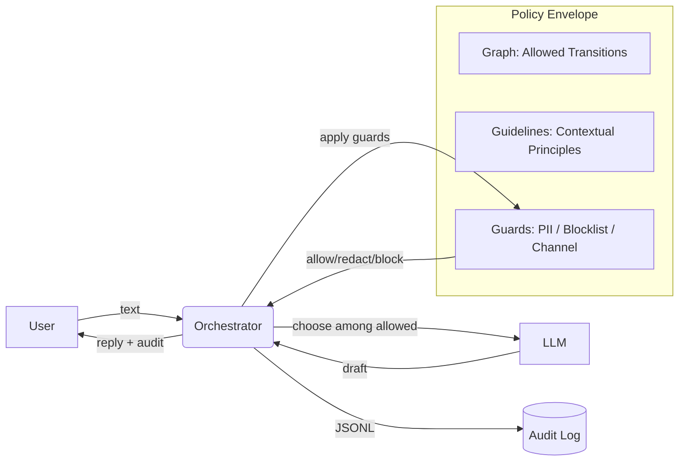

# LexGuard — Compliant AI Chat Agents (Interview Deck)

## Problem
- LLMs are powerful but unpredictable
- Flows are predictable but brittle
- We need **both** for multi-stage conversations with compliance

## Idea
- Put the LLM inside a **policy envelope**
- Deterministic **graph** controls *where* it can go
- **Guidelines** shape *how* it speaks
- **Guards** enforce safety/compliance

## Architecture (Mermaid)

## Demo
- HR / EOR onboarding assistant
- PII only through **secure_upload**
- Contract summary without raw PII
- Approval gate before finalization

## Why It Works
- **Predictability**: Graph + DSL
- **Flexibility**: LLM drafts & selects within bounds
- **Compliance**: Guards + Audit + Approvals
- **Maintainability**: Tests and explicit policy

## Roadmap
- Stronger guards (DLP, classification)
- Tool authz scopes per intent
- Confidence scoring / auto-escalation
- Synthetic scenario generation for tests
